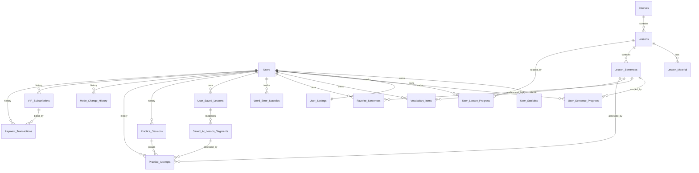

# Production learning schema

This extension keeps the existing course, lesson, session, recording, transcript, AI feedback, and aggregate statistics tables. Durable per-user state and immutable business history are separated into focused tables.

## Invariants and ownership

- Lesson progress is unique by `(user_id, lesson_id, practice_tab)`; sentence progress is unique by `(user_id, sentence_id, practice_tab)`.
- A practice attempt references exactly one durable sentence source: a curriculum `Lesson_Sentences` row or a saved AI segment. `(user_id, idempotency_key)` prevents retry duplicates.
- Word error state is unique by normalized word per user. Vocabulary is unique by user, normalized word, and language. Favorites are unique by user and sentence.
- Saved AI lessons retain a text snapshot and ordered segment snapshots. Provider identifiers, media URLs, licensing, and source-review state are metadata only; expired media does not remove the saved text.
- Subscription provider references and payment provider transaction/idempotency keys are unique. Payment integration behavior is deliberately outside this schema.
- `ROWVERSION` protects mutable singleton/aggregate state (`User_Statistics`, settings, progress, word errors, vocabulary, saved lessons, subscriptions) from lost updates. Append-only history uses uniqueness/idempotency instead.

## Delete policy

- User-owned, reproducible state cascades from the user: settings, progress, vocabulary, favorites, word statistics, and saved AI lessons/segments.
- Practice attempts/sessions, mode changes, subscriptions, and payments use `NO ACTION`. A user or lesson with business history must be anonymized/retained or explicitly archived before deletion.
- Course-to-lesson and lesson-to-material/sentence remain aggregate cascades, but historical/progress references block destructive content deletion.
- Recordings, transcripts, and AI feedback remain children of a practice session and cascade only when that session is explicitly removed.

## Storage boundary

SQL Server stores business state, snapshot text, URLs, source/provider references, scores, and licensing metadata. Audio/video binary, raw provider responses, dictionary corpora, and short-lived API lookup results belong in object storage or a TTL cache.

## Deployment

Run `WebShadowing/Database/auth_schema_update.sql` if upgrading a pre-authentication database, then run `WebShadowing/Database/production_learning_schema_update.sql` against the selected target database. The production extension guards every schema/data operation and can be rerun after success or partial failure.
