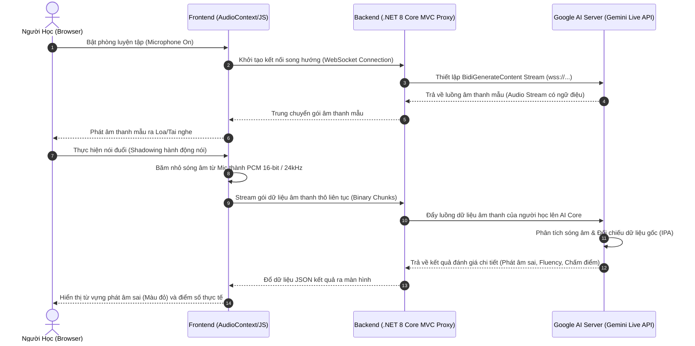

# ShadowSpeak AI - Web App Luyện Nói Tiếng Anh Theo Phương Pháp Shadowing Tích Hợp Trí Tuệ Nhân Tạo

**ShadowSpeak AI** là nền tảng hiện đại ứng dụng Trí tuệ nhân tạo (AI) kết hợp kiến trúc truyền tải dữ liệu thời gian thực giúp người học cải thiện kỹ năng phát âm, ngữ điệu và phản xạ tiếng Anh thông qua kỹ thuật nói đuổi (Shadowing).

---

## 🌟 I. Tổng Quan Đề Tài & Điểm Đột Phá Công Nghệ

Cốt lõi của phương pháp Shadowing là người học sẽ nghe một đoạn âm thanh mẫu (giọng chuẩn), sau đó lập tức lặp lại (như một cái bóng) để rèn luyện cơ miệng và phản xạ cơ mặt. 

### 🛑 Hạn chế của các hệ thống cũ:
* Sử dụng giọng đọc nhân tạo (TTS) đều đều, vô cảm, thiếu ngữ điệu tự nhiên.
* Cơ chế ghi âm ngắt quãng: Thu âm thành file ➡️ Gửi file lên Server ➡️ Chờ phản hồi (gây độ trễ cao, ngắt mạch học tập).

### ✨ Điểm đột phá của ShadowSpeak AI:
1. **Âm thanh có ngữ điệu tự nhiên (Prosody/Intonation):** Tích hợp luồng âm thanh thế hệ mới giúp giọng đọc mẫu của AI có đầy đủ cảm xúc, nhấn nhá, lên giọng xuống giọng y hệt người thật bản xứ (Accent: US English).
2. **Giao tiếp luồng song hướng thời gian thực (Bi-directional Streaming):** Loại bỏ hoàn toàn cơ chế thu âm bằng file thủ công. Hệ thống thiết lập đường truyền WebSockets song hướng chạy liên tục; giọng nói từ Micro của người học được băm nhỏ thành các gói dữ liệu và đẩy liên tục lên AI Server để phân tích ngay lập tức.

---

## 📐 II. Sơ Đồ Kiến Trúc Luồng Dữ Liệu Thời Gian Thực (System Architecture)

Dự án áp dụng mô hình **WebSocket Proxy Gateway** bảo mật. Client giao tiếp với Backend C# thông qua giao thức SignalR/WebSockets nội bộ, Backend đóng vai trò trung chuyển luồng Stream nhị phân lên Google AI Server nhằm bảo mật tuyệt đối API Key.



---

## 🛠️ III. Kiến Trúc Mã Nguồn & Công Nghệ Sử Dụng

### 1. Các công nghệ cốt lõi

* **Frontend Engine:** HTML5 Media Devices API, Tailwind CSS Engine v3, Razor View Engine, Lucide Icons.
* **Backend Framework:** **ASP.NET Core MVC (.NET 8.0)** áp dụng nguyên lý Dependency Injection (DI) và lập trình bất đồng bộ (`async/await`).
* **Database Management:** **Microsoft SQL Server** kết hợp Entity Framework Core (Code-First) quản lý cơ sở dữ liệu quan hệ chặt chẽ.

### 2. Cấu Trúc Thư Mục Dự Án Chuẩn Doanh Nghiệp

```text
/ (Workspace Root)
├── Controllers/
│   ├── AccountController.cs   <- Quản lý luồng Đăng nhập, Đăng ký, và Gói Premium
│   ├── ApiController.cs       <- Gateway kết nối luồng Live Stream WebSockets với Gemini AI
│   └── HomeController.cs      <- Điều hướng danh mục Khóa học, Thống kê, và Cài đặt
├── Models/
│   └── CourseModels.cs        <- Định nghĩa cấu trúc thực thể dữ liệu (Lesson, Sentence, UserProfile)
├── Services/
│   ├── GeminiService.cs       <- Xử lý logic kết nối API và truyền tải dữ liệu luồng âm thanh
│   └── LessonService.cs       <- Quản lý kho bài học SGK tĩnh và bài học do AI sinh ra
├── Views/
│   ├── _ViewImports.cshtml    <- Đăng ký Namespaces toàn cục và Razor Tag Helpers
│   ├── _ViewStart.cshtml      <- Định nghĩa Layout sườn mặc định của hệ thống View
│   ├── Account/               <- Giao diện Login, Register, Thiết lập lộ trình học cá nhân
│   ├── Home/                  <- Giao diện trang chủ Khóa học, Thống kê SRS, Phòng luyện nói Shadowing
│   └── Shared/
│       └── _Layout.cshtml     <- Thanh điều hướng đồng bộ (Streak, Hearts, EXP) và Darkmode
├── wwwroot/
│   ├── css/site.css           <- Custom CSS & cấu hình tối ưu hóa hiển thị giao diện
│   └── js/site.js             <- Tiện ích JavaScript hỗ trợ tương tác âm thanh thô
├── Program.cs                 <- Đăng ký DI, cấu hình Middleware Pipeline, và Routing chính
└── ShadowSpeakMvc.csproj      <- Quản lý các gói thư viện NuGet phụ thuộc hệ thống

```

---

## 🎨 IV. Tiêu Chuẩn Thiết Kế UI/UX & Hệ Thống Nhận Diện (Design System)

Giao diện được nghiên cứu cấu trúc kỹ lưỡng nhằm phục vụ tối đa cho ứng dụng EdTech, tối ưu hóa trải nghiệm tương tác âm thanh.

### 1. Nguyên tắc thiết kế (Design Principles)

* **Trực quan hóa dữ liệu (Data Visualization):** Sử dụng các biểu đồ tiến trình học tập, chuỗi ngày học liên tiếp (Streak) bằng đồ họa sống động để kích thích động lực học tập (Gamification).
* **Thiết kế tập trung (Focus-Oriented UI):** Phòng luyện tập Shadowing được tối giản hóa các thành phần gây xao nhãng, giúp người học tập trung hoàn toàn vào tai nghe và khẩu hình phát âm.


### 2. Thông số kỹ thuật Design System (Đã hiện thực hóa qua Tailwind CSS)

* **Bảng màu chủ đạo (Color Palette):**
* *Primary Color:* Indigo Premium (`#4F46E5` - Đại diện cho công nghệ, trí tuệ nhân tạo).
* *Neutral Slate:* Slate Gray (`#E2E8F0` cho viền/nhãn dán và `#1D293D` cho màu chữ - Tạo cảm giác lì, tinh tế, hiện đại).
* *Gamification System:* Orange Amber (`#F59E0B` cho Streak lửa) và Rose Crimson (`#F43F5E` cho điểm số Tim).


* **Hệ Thống Phông Chữ (Typography):**
* *Font hiển thị tiêu đề:* `Space Grotesk` (Mang phong cách hình khối công nghệ, góc cạnh).
* *Font văn bản hệ thống:* `Inter` (Font chữ quốc dân tối ưu hóa hiển thị sắc nét trên mọi kích thước màn hình).
* *Font phiên âm quốc tế:* `JetBrains Mono` (Font chữ đơn cách - Monospace, giúp các ký tự phiên âm IPA đứng thẳng hàng, dễ đọc).


* **Giao diện đa nền văn minh:** Tích hợp bộ lọc chế độ **Light/Dark Mode** thời gian thực, đồng bộ tự động dựa theo cấu hình hệ điều hành của người dùng (`prefers-color-scheme`).

---

## 💻 V. Công Cụ Thiết Kế & Quản Lý Dự Án (Tooling & Environment)

Dự án áp dụng quy trình sản xuất phần mềm chuyên nghiệp thông qua việc sử dụng các công cụ tiêu chuẩn ngành:

* **Công cụ thiết kế UI/UX:** **Figma** (Sử dụng để xây dựng Wireframe, High-Fidelity Design, Prototyping tương tác luồng người dùng và bàn giao thông số Design System cho giai đoạn lập trình Front-end).
* **Môi trường phát triển tích hợp (IDE):** **Visual Studio** (Hỗ trợ quản lý Solution, biên dịch mã nguồn C#, gỡ lỗi trực tiếp qua Terminal và tối ưu hóa hệ thống thư viện NuGet).
* **Hệ thống quản lý phiên bản:** **Git & GitHub** (Triển khai quy trình làm việc theo nhánh - Branching Strategy, quản lý lịch sử Commit sạch sẽ và kiểm soát chất lượng mã nguồn nghiêm ngặt thông qua Pull Request).

---

## 🚀 VI. Hướng Dẫn Cài Đặt & Khởi Chạy Dự Án (Local Development)

### Yêu cầu hệ thống:

* .NET 8.0 SDK trở lên.
* Microsoft SQL Server.
* Một mã cấu hình **Gemini API Key** hợp lệ từ Google AI Studio.

### Các bước triển khai:

1. **Sao chép mã nguồn về máy cá nhân:**

```bash
   git clone [https://github.com/your-username/ShadowSpeakMvc.git](https://github.com/your-username/ShadowSpeakMvc.git)
   cd ShadowSpeakMvc

```

2. **Cấu hình môi trường:**
Mở file `appsettings.json` và điền mã API Key bảo mật của bạn vào:

```json
   {
     "Logging": {
       "LogLevel": {
         "Default": "Information",
         "Microsoft.AspNetCore": "Warning"
       }
     },
     "AllowedHosts": "*",
     "Gemini": {
         "ApiKey": "MÃ_API_KEY_GEMINI_CỦA_BẠN_TẠI_ĐÂY"
     }
   }

```

3. **Khôi phục các thư viện phụ thuộc (NuGet Packages):**

```bash
   dotnet restore

```

4. **Biên dịch và chạy dự án:**

```bash
   dotnet watch run

```

Ứng dụng sẽ tự động kích hoạt trình duyệt và lắng nghe tại đường dẫn mặc định: `http://localhost:5000` hoặc `https://localhost:5001`.

```

```
